

# ☁️ AWS Serverless Order Processing System

Arquitetura Serverless Orientada a Eventos para Processamento de Pedidos utilizando AWS

## 📖 Sobre o Projeto

Este projeto implementa uma arquitetura Serverless orientada a eventos para processamento de pedidos utilizando serviços gerenciados da AWS.

A solução foi desenvolvida com o objetivo de simular um cenário corporativo de processamento assíncrono de pedidos, permitindo que requisições sejam recebidas por APIs ou por arquivos JSON armazenados em um Data Lake no Amazon S3.

Durante a implementação foram aplicados conceitos de:

* Event Driven Architecture (EDA)
* Microsserviços desacoplados
* Processamento assíncrono
* Filas de mensagens
* Persistência NoSQL
* Tratamento de falhas
* Observabilidade
* Arquiteturas Cloud Native

---

# 🎯 Objetivo

Construir uma plataforma capaz de:

* Receber pedidos através de uma API REST.
* Receber pedidos através de arquivos JSON enviados ao Amazon S3.
* Validar dados antes do processamento.
* Publicar eventos para múltiplos consumidores.
* Persistir informações em banco NoSQL.
* Notificar falhas automaticamente.
* Garantir resiliência através de Dead Letter Queues (DLQ).

---

# 🏗️ Arquitetura da Solução

A arquitetura foi construída utilizando serviços totalmente gerenciados da AWS, eliminando a necessidade de administração de servidores e permitindo escalabilidade automática conforme a demanda.

Fluxo principal:

API Gateway → Lambda → SQS FIFO → Lambda → EventBridge → SQS → Lambda → DynamoDB

Fluxo de arquivos:

S3 → SQS → Lambda → SNS → DynamoDB

---

# 🚀 Etapa 1 — Criação da API de Entrada

O primeiro passo consistiu na criação de uma API REST utilizando Amazon API Gateway.

A API foi configurada para receber requisições HTTP contendo informações de pedidos.

Responsabilidades:

* Receber requisições dos clientes.
* Encaminhar eventos para a camada de processamento.
* Disponibilizar endpoint público.

  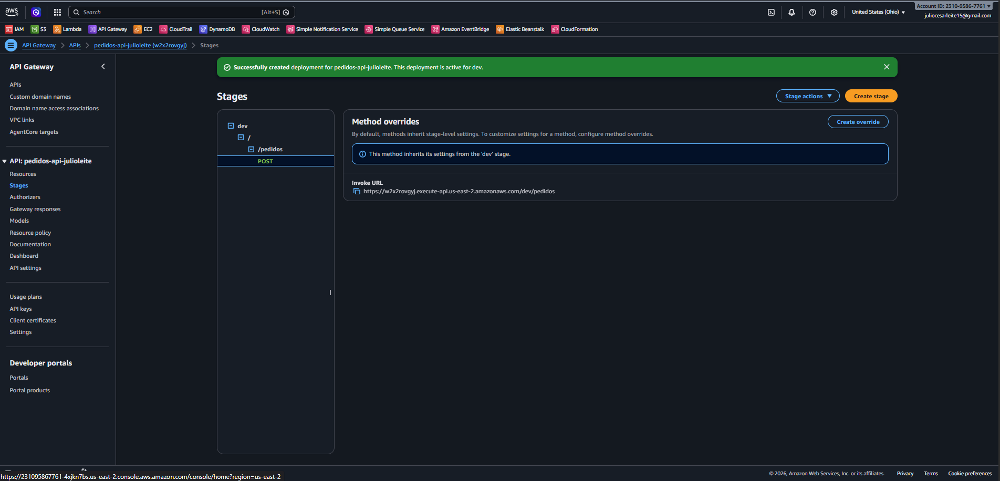

---

# 🧪 Etapa 2 — Teste da API

Após a publicação da API foi realizado um teste utilizando uma requisição HTTP POST contendo informações de um pedido.

Payload utilizado:

{
"pedidoId": "1001",
"clienteId": "cliente001"
}

Resultado:

* Pedido recebido com sucesso.
* Resposta HTTP retornada pela API.
* Fluxo iniciado corretamente.

  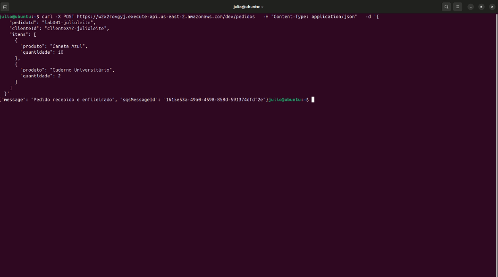

---

# ⚙️ Etapa 3 — Pré-Validação com AWS Lambda

Foi desenvolvida uma função Lambda responsável pela validação inicial do payload recebido.

Objetivos:

* Garantir que os dados mínimos estejam presentes.
* Evitar mensagens inválidas na fila.
* Registrar logs para auditoria.

Após validação, o pedido é enviado para uma fila FIFO.

  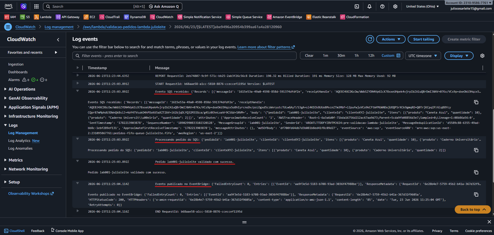

---

# 📬 Etapa 4 — Mensageria com Amazon SQS FIFO

A fila FIFO foi utilizada para garantir:

* Ordenação das mensagens.
* Evitar duplicidade de processamento.
* Desacoplamento entre componentes.

Essa abordagem permite absorver picos de requisições sem impactar o restante da aplicação.

  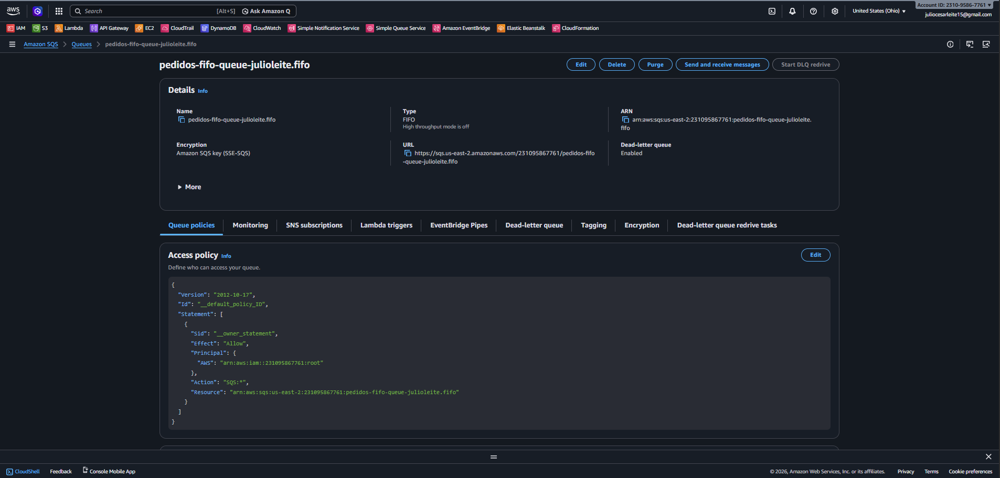

---

# ✅ Etapa 5 — Validação de Negócio

Uma segunda função Lambda consome as mensagens da fila FIFO.

Responsabilidades:

* Executar validações de negócio.
* Garantir consistência dos pedidos.
* Publicar eventos para o EventBridge.

  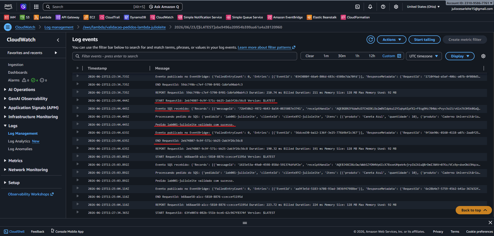

---

# 📡 Etapa 6 — Event Driven Architecture com EventBridge

Após validação, eventos são publicados no Amazon EventBridge.

O EventBridge atua como barramento central de eventos, permitindo desacoplamento total entre produtores e consumidores.

Benefícios:

* Escalabilidade.
* Baixo acoplamento.
* Facilidade de evolução da arquitetura.

  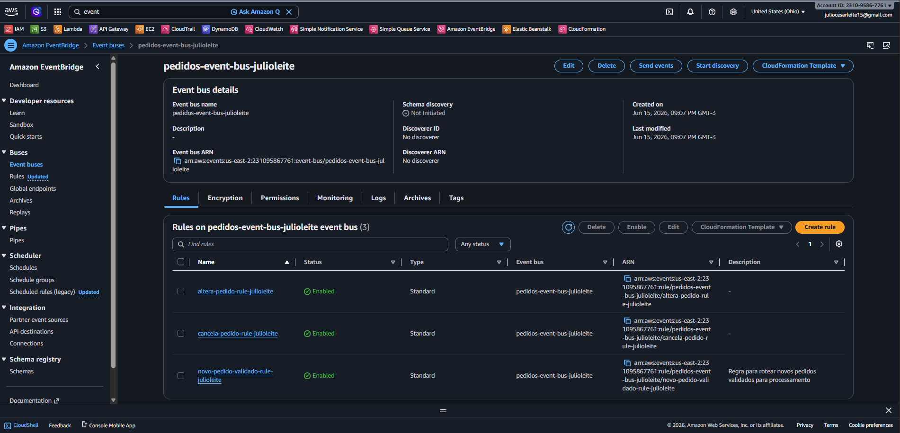

---

# 🔄 Etapa 7 — Processamento Assíncrono dos Pedidos

Os eventos roteados pelo EventBridge são enviados para uma fila de processamento.

Uma Lambda especializada consome os eventos e executa a lógica principal da aplicação.

Atividades realizadas:

* Processamento dos pedidos.
* Atualização de status.
* Persistência das informações.

  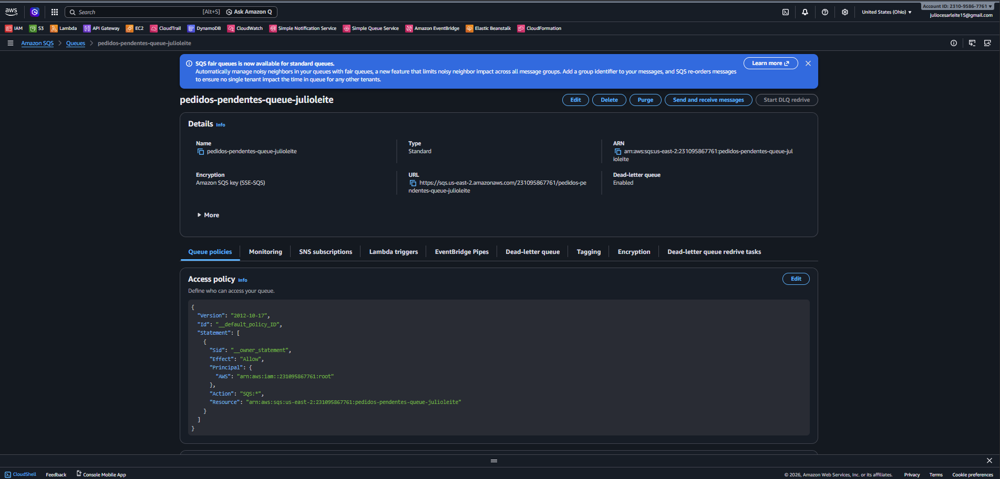

  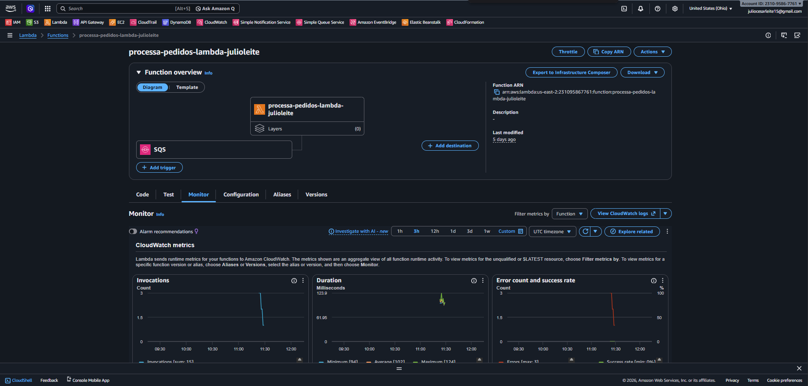

---

# 💾 Etapa 8 — Persistência com DynamoDB

Os pedidos processados são armazenados em uma tabela DynamoDB.

Campos armazenados:

* pedidoId
* clienteId
* statusPedido
* origem
* timestampProcessamento

  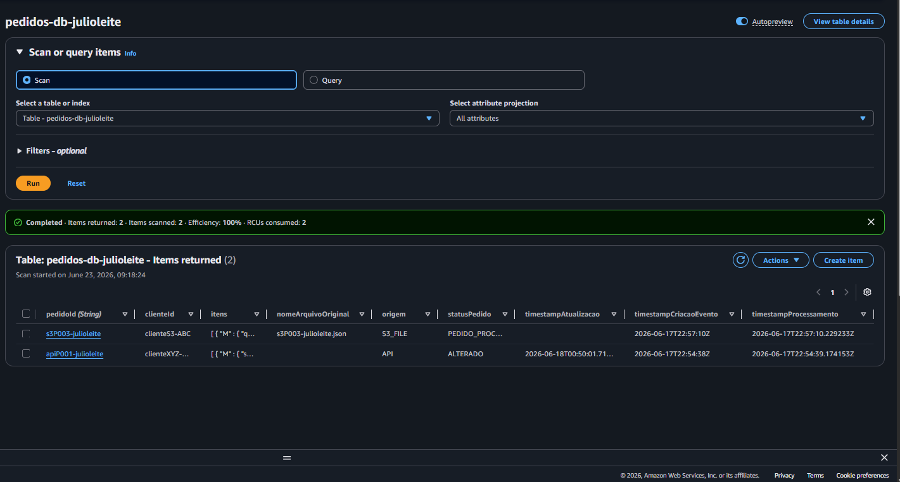

---

# 📂 Etapa 9 — Processamento de Arquivos via Amazon S3

Além da API, a solução também suporta processamento em lote através de arquivos JSON.

Arquivos utilizados durante os testes:

* arquivo_com_pedidos.json
* s3P003-julioleite.json
* arquivo_schema_invalido.json

  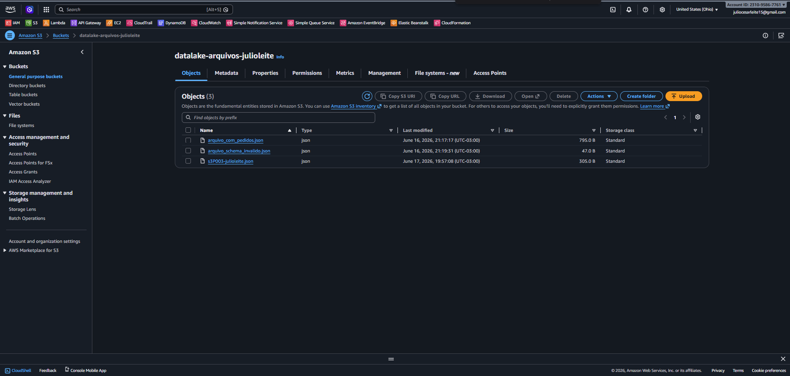

---

# 🔍 Etapa 10 — Validação de Arquivos

Quando um arquivo é enviado ao bucket S3, uma Lambda é acionada automaticamente.

Responsabilidades:

* Validar schema.
* Extrair pedidos.
* Enviar mensagens para a fila principal.

  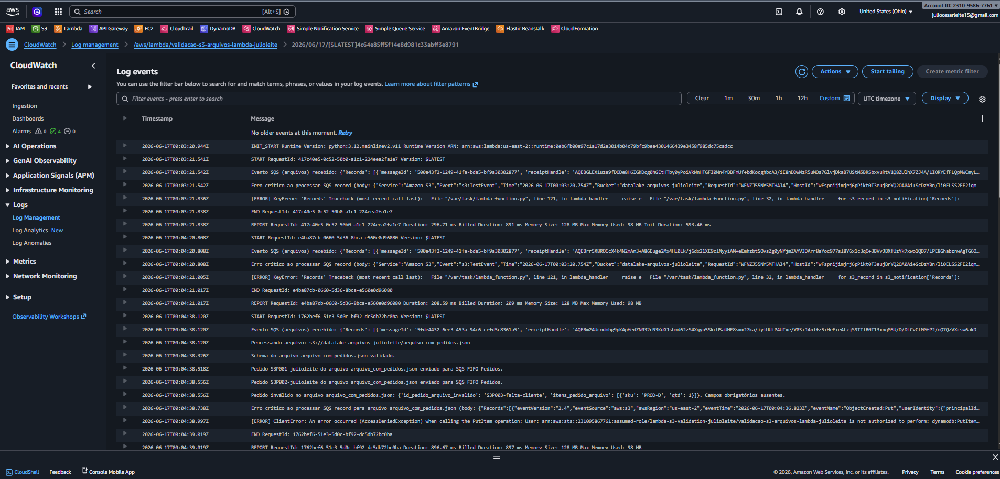

---

# 📊 Etapa 11 — Histórico de Processamento

Todas as execuções relacionadas ao processamento de arquivos são registradas em uma tabela DynamoDB específica para auditoria.

  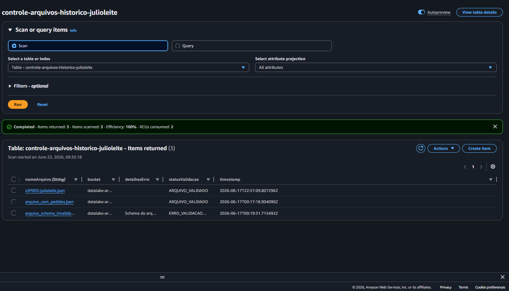

---

# 📧 Etapa 12 — Notificações com SNS

Foi implementado um mecanismo de alerta utilizando Amazon SNS.

Sempre que um arquivo inválido é detectado:

* Um evento é gerado.
* Uma notificação é enviada por e-mail.
* O erro é registrado para análise.

  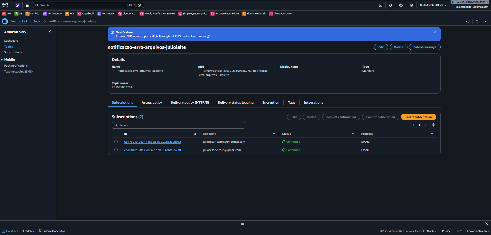

  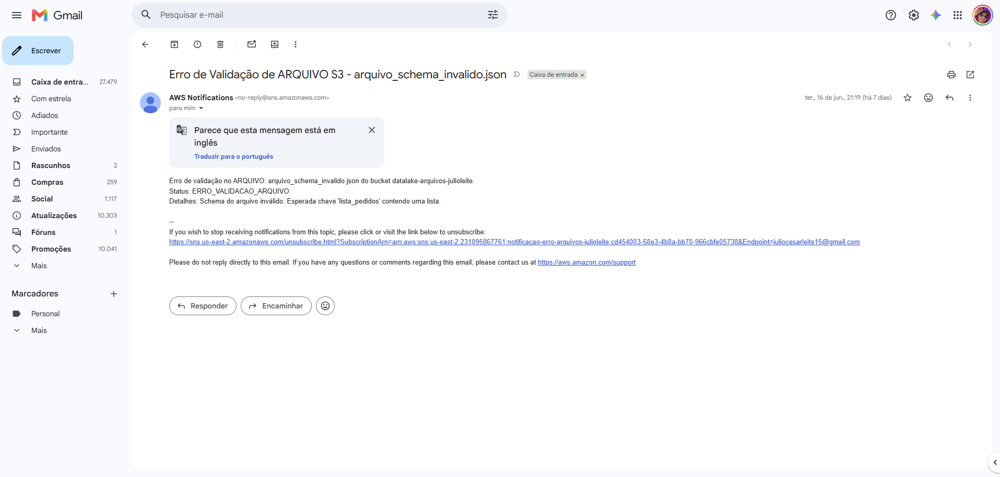

---

# 🛡️ Etapa 13 — Tratamento de Falhas com DLQ

Para aumentar a resiliência da solução foram implementadas Dead Letter Queues.

Objetivos:

* Evitar perda de mensagens.
* Permitir reprocessamento.
* Facilitar troubleshooting.

DLQ de Arquivos:

  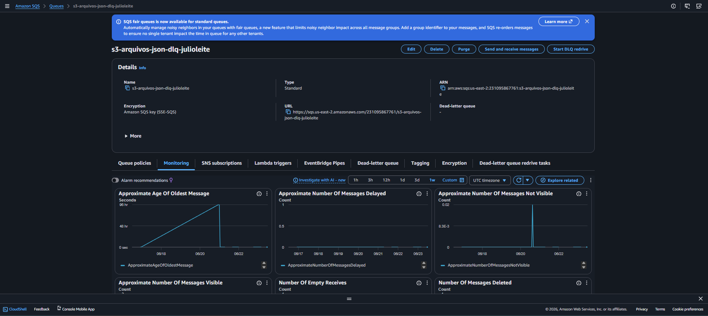

DLQ de Pedidos:

  

---

# 📈 Resultados Obtidos

Durante o projeto foram implementados com sucesso:

✅ API Gateway

✅ AWS Lambda

✅ Amazon SQS FIFO

✅ Amazon EventBridge

✅ Amazon DynamoDB

✅ Amazon S3

✅ Amazon SNS

✅ Dead Letter Queues

✅ CloudWatch Logs

---

# 💡 Competências Demonstradas

* Arquitetura Serverless
* Event Driven Architecture
* Processamento Assíncrono
* AWS Lambda
* Amazon API Gateway
* Amazon SQS FIFO e Standard
* Amazon EventBridge
* Amazon DynamoDB
* Amazon S3
* Amazon SNS
* CloudWatch
* Tratamento de Falhas
* Cloud Native Design
* Integração entre Serviços AWS

---

# 👨‍💻 Autor

Julio Leite

Analista de Infraestrutura | Cloud Computing | AWS

Projeto desenvolvido para consolidar conhecimentos práticos em arquitetura Serverless e processamento orientado a eventos utilizando serviços AWS.
